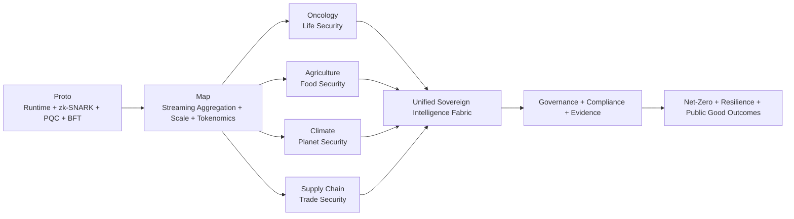

# Ecosystem Architecture

Canonical lifecycle architecture for the Sovereign Mohawk platform across health, food, climate, and trade domains.

## Core Repositories

- https://github.com/rwilliamspbg-ops/Sovereign-Mohawk-Proto
- https://github.com/rwilliamspbg-ops/Sovereign_Map_Federated_Learning
- https://github.com/rwilliamspbg-ops/Sovereign_Mohawk_Oncology_Global
- https://github.com/rwilliamspbg-ops/Sovereign_Mohawk_Agriculture_Global
- https://github.com/rwilliamspbg-ops/Sovereign_Mohawk_Climate_Global
- https://github.com/rwilliamspbg-ops/Sovereign_Mohawk_SupplyChain_Global
